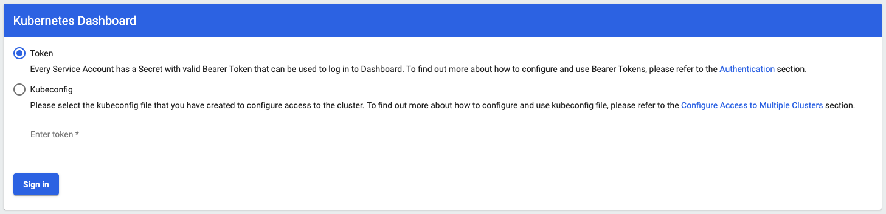
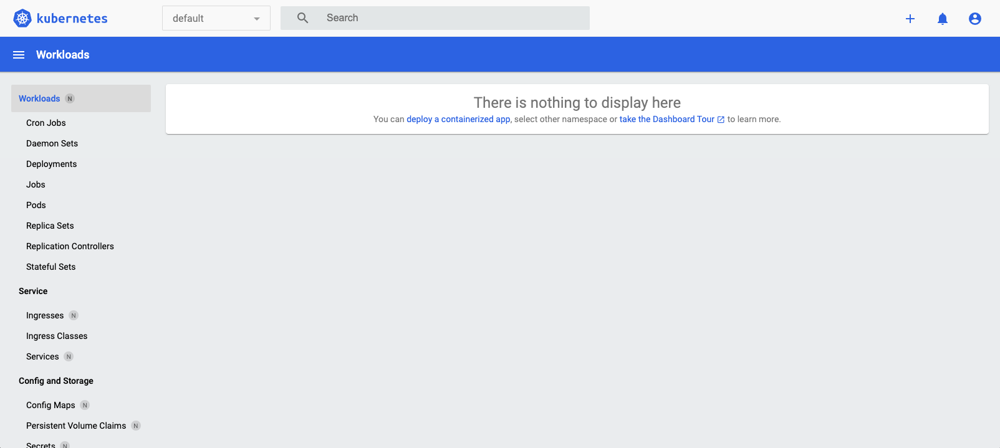
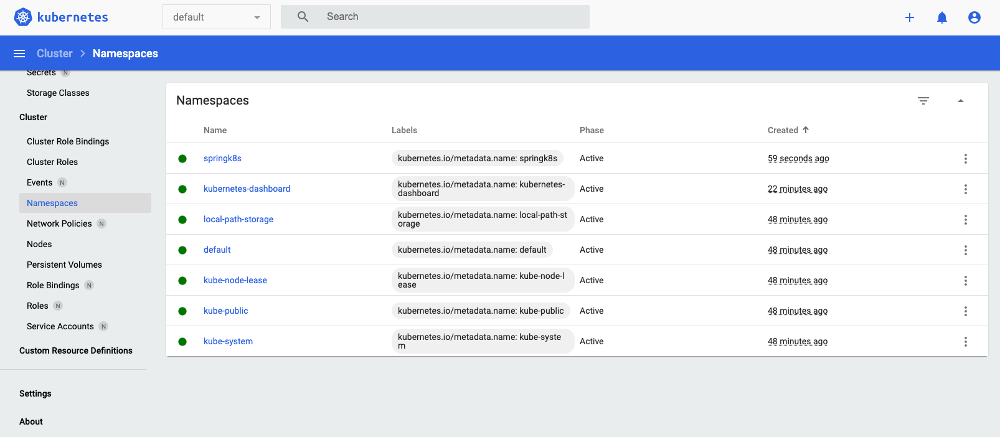

# springk8s - example project for explaining how to deploy Spring Boot application to K8s

## OS

- macOS Ventura

## Arch

- Apple M2 Pro

## Installation

### Tools

- Colima - https://github.com/abiosoft/colima
- Lima - https://github.com/lima-vm/lima
- Docker - https://www.docker.com/
- Docker Compose - https://docs.docker.com/compose/
- kind - https://kind.sigs.k8s.io/

```shell
$ brew install colima lima kind kubectl docker docker-compose
```

## Project

### Actuator

Actuator is mainly used to expose operational information about the running application — health, metrics, info, dump, env, etc.

#### Dependencies

```groovy
implementation 'org.springframework.boot:spring-boot-starter-actuator'
```

#### Configurations

```yaml
management:
  endpoints:
    web:
      exposure:
        include: "*"
```

this configuration will show all endpoints of Actuator

#### Endpoints

- actuator : http://localhost:8080/actuator

  for this sample project, following information will be shown

  ```json
  // 20230518140118
  // http://localhost:8080/actuator
  
  {
    "_links": {
      "self": {
        "href": "http://localhost:8080/actuator",
        "templated": false
      },
      "beans": {
        "href": "http://localhost:8080/actuator/beans",
        "templated": false
      },
      "caches": {
        "href": "http://localhost:8080/actuator/caches",
        "templated": false
      },
      "caches-cache": {
        "href": "http://localhost:8080/actuator/caches/{cache}",
        "templated": true
      },
      "health": {
        "href": "http://localhost:8080/actuator/health",
        "templated": false
      },
      "health-path": {
        "href": "http://localhost:8080/actuator/health/{*path}",
        "templated": true
      },
      "info": {
        "href": "http://localhost:8080/actuator/info",
        "templated": false
      },
      "conditions": {
        "href": "http://localhost:8080/actuator/conditions",
        "templated": false
      },
      "configprops": {
        "href": "http://localhost:8080/actuator/configprops",
        "templated": false
      },
      "configprops-prefix": {
        "href": "http://localhost:8080/actuator/configprops/{prefix}",
        "templated": true
      },
      "env-toMatch": {
        "href": "http://localhost:8080/actuator/env/{toMatch}",
        "templated": true
      },
      "env": {
        "href": "http://localhost:8080/actuator/env",
        "templated": false
      },
      "loggers-name": {
        "href": "http://localhost:8080/actuator/loggers/{name}",
        "templated": true
      },
      "loggers": {
        "href": "http://localhost:8080/actuator/loggers",
        "templated": false
      },
      "heapdump": {
        "href": "http://localhost:8080/actuator/heapdump",
        "templated": false
      },
      "threaddump": {
        "href": "http://localhost:8080/actuator/threaddump",
        "templated": false
      },
      "metrics-requiredMetricName": {
        "href": "http://localhost:8080/actuator/metrics/{requiredMetricName}",
        "templated": true
      },
      "metrics": {
        "href": "http://localhost:8080/actuator/metrics",
        "templated": false
      },
      "scheduledtasks": {
        "href": "http://localhost:8080/actuator/scheduledtasks",
        "templated": false
      },
      "mappings": {
        "href": "http://localhost:8080/actuator/mappings",
        "templated": false
      }
    }
  }
  ```

### OpenAPI

#### Dependencies

For Spring Boot 3, you must use

```groovy
implementation 'org.springdoc:springdoc-openapi-starter-webmvc-ui:2.0.4'
```

to replace following package

```groovy
implementation 'org.springdoc:springdoc-openapi-ui:1.7.0'
```

** this package only could be used for Spring Boot 2.x **

#### Configuration

```yaml
springdoc:
  api-docs:
    path: '/apidocs'
    enabled: true
  swagger-ui:
    path: 'swagger-ui.html'
    enabled: true
```

#### Pages

- API Doc: http://localhost:8080/apidocs

  for this sample project, following information will be shown

  ```json
  // 20230518140203
  // http://localhost:8080/apidocs
  
  {
    "openapi": "3.0.1",
    "info": {
      "title": "OpenAPI Demo APIs",
      "version": "v0"
    },
    "servers": [
      {
        "url": "http://localhost:8080",
        "description": "Generated server url"
      }
    ],
    "paths": {
      "/profile": {
        "get": {
          "tags": [
            "profile"
          ],
          "operationId": "profile",
          "responses": {
            "200": {
              "description": "OK",
              "content": {
                "*/*": {
                  "schema": {
                    "type": "array",
                    "items": {
                      "type": "string"
                    }
                  }
                }
              }
            }
          }
        }
      },
      "/": {
        "get": {
          "tags": [
            "hello"
          ],
          "operationId": "hello",
          "responses": {
            "200": {
              "description": "OK",
              "content": {
                "*/*": {
                  "schema": {
                    "type": "string"
                  }
                }
              }
            }
          }
        }
      }
    },
    "components": {
      
    }
  }
  ```

- Swagger UI: http://localhost:8080/swagger-ui.html

  for this sample project, the page will be

  

### RESTful API

- hello : http://localhost:8080/
- profile : http://localhost:8080/profile

### Dockerfile

```dockerfile
FROM isahl/openjdk17 AS BUILDER
ENV PROJECT_FOLDER=/root/springk8s
RUN mkdir $PROJECT_FOLDER
ADD ./gradle $PROJECT_FOLDER/gradle
ADD ./src $PROJECT_FOLDER/src
COPY ./build.gradle $PROJECT_FOLDER/build.gradle
COPY ./gradlew $PROJECT_FOLDER/gradlew
COPY ./settings.gradle $PROJECT_FOLDER/settings.gradle
RUN cd $PROJECT_FOLDER && ./gradlew clean && ./gradlew build -x test

FROM isahl/openjdk17
ENV LIB_DIR=/usr/local/lib/springk8s
ENV CONFIG_DIR=/etc/springk8s/
ENV BIN_DIR=/usr/local/bin
RUN mkdir -p $LIB_DIR
RUN mkdir -p $CONFIG_DIR
COPY --from=BUILDER /root/springk8s/build/libs/springk8s-0.0.1-SNAPSHOT.jar $LIB_DIR/springk8s.jar
RUN echo "java -jar $LIB_DIR/springk8s.jar com.simplejourney.springk8s.Springk8sApplication --spring.config.location=$CONFIG_DIR" > $BIN_DIR/springk8s
RUN chmod 755 $BIN_DIR/springk8s
CMD $BIN_DIR/springk8s
```

### Build

#### Build Spring Boot Jar

```shell
$ ./gradlew build
```

#### Start Colima

```shell
$ colima colima start [-a aarch64] # for macOS M2, need add arch parameter
```

#### Build Docker Image

```shell
$ docker build -t springk8s .
```

#### Launch

##### Gradle

```shell
$ ./gradkew bootRun
```

##### Jar

###### Default

```shell
$ java -jar $LIB_DIR/springk8s.jar com.simplejourney.springk8s.Springk8sApplication
```

###### Jar vs External Configuration

```shell
$ java -jar $LIB_DIR/springk8s.jar com.simplejourney.springk8s.Springk8sApplication --spring.config.location=/path/to/config/folder
```

###### Jar vs Special Profile

```shell
$ java -jar $LIB_DIR/springk8s.jar com.simplejourney.springk8s.Springk8sApplication -- spring.profiles.active=dev
```

### K8s

#### K8s Cluster

##### Start

```shell
$ kind create cluster
```

##### Stop

```shell
$ kind delete cluster
```

#### Dashboard

##### Github: https://github.com/kubernetes/dashboard

##### Deploy:

for monitor the status of cluster easier, we could deply Dashboard to our cluster with following commands

```shell
$ kubectl create -f https://raw.githubusercontent.com/kubernetes/dashboard/v2.7.0/aio/deploy/recommended.yaml
```

if you could not connect to above url, could get deploy yml at aio/deploy folder of above repository.

then, executes following commands to bind 'admin-user' and roles. Otherwise, you get 'error: failed to create token: serviceaccounts "admin-user" not found' error when you want to create token

```shell
$ kubectl apply -f ./dashboard/service-account.yml
$ kubectl apply -f ./dashboard/role-binding.yml
```

after that, launch proxy

```shell
$ kubectl proxy > $HOME/.kube/dashboard.log &
```

after above commands executed, wait about 1 minute, and open web browser to open following url

```url
http://localhost:8001/api/v1/namespaces/kubernetes-dashboard/services/https:kubernetes-dashboard:/proxy/
```

on macOS, you could use following command to open the default web browser with url

```shell
$ open 'http://localhost:8001/api/v1/namespaces/kubernetes-dashboard/services/https:kubernetes-dashboard:/proxy/'
```

Then, you will see the page looks like following



by defaults, we will use 'Token' to login the dashboard

you could use following command to create a token which will be expired after 1 hour.

After token expired, you could create a new one with command.

```shell
$ kubectl -n kubernetes-dashboard create token admin-user --duration 3600s
```

When you logged in, you could see



#### Deploy String Boot Application

##### Namespace

Firstly, we need create namespace for our application

```yaml
apiVersion: v1
kind: Namespace
metadata:
  name: springk8s
```

run following command to apply

```shell
$ kubectl apply -f ./springk8s/namespace.yml
```

after above command executed successfully, you could check it with dashboard



Or, just use following command to check

```shell
$ kubectl get namespace
```

output

```
NAME                   STATUS   AGE
default                Active   50m
kube-node-lease        Active   50m
kube-public            Active   50m
kube-system            Active   50m
kubernetes-dashboard   Active   24m
local-path-storage     Active   50m
springk8s              Active   2m58s
```

##### ConfigMap

there are 2 ways to create ConfigMap

1. create ConfigMap with yml file, example

   ```yaml
   apiVersion: v1
   kind: ConfigMap
   metadata:
     creationTimestamp: 2022-02-18T18:52:05Z
     name: app-config
     namespace: springk8s
     resourceVersion: "1"
     uid: b4952dc3-d670-11e5-8cd0-68f728db1985
   data:
     config-1.properties: |
       enemies=aliens
       lives=3
       enemies.cheat=true
       enemies.cheat.level=noGoodRotten
       secret.code.passphrase=UUDDLRLRBABAS
       secret.code.allowed=true
       secret.code.lives=30    
     config-2.properties: |
       color.good=purple
       color.bad=yellow
       allow.textmode=true
       how.nice.to.look=fairlyNice 
   ```

2. create ConfigMap with command from yaml or properties file

   ```shell
   $ kubectl create configmap springk8s-settings -n springk8s --from-file springk8s/app/application.yaml
   ```

##### Service

service.yml

```yaml
apiVersion: v1
kind: Service
metadata:
  labels:
    k8s-app: springk8s-backend
  name: springk8s-backend
  namespace: springk8s
spec:
  ports:
    - port: 8080
      targetPort: 8080
  selector:
    k8s-app: springk8s-backend
```

service-account.yml

```yml
apiVersion: v1
kind: ServiceAccount
metadata:
  labels:
    k8s-app: springk8s-backend
  name: springk8s-backend
  namespace: springk8s
```

Apply above configurations

```shell
$ kubectl apply -f ./springk8s/app/service.yml
$ kubectl apply -f ./springk8s/app/service-account.yml
```

##### Deploy

```yaml
apiVersion: apps/v1
kind: Deployment
metadata:
  labels:
    k8s-app: springk8s-backend
  name: springk8s-backend
  namespace: springk8s
spec:
  selector:
    matchLabels:
      k8s-app: springk8s-backend
  template:
    metadata:
      labels:
        k8s-app: springk8s-backend
    spec:
      securityContext:
        seccompProfile:
          type: RuntimeDefault
      containers:
        - name: springk8s-backend
          image: springk8s:latest
          imagePullPolicy: IfNotPresent
          ports:
            - containerPort: 8080
              protocol: TCP
          volumeMounts:
            - mountPath: /etc/springk8s
              name: springk8s-config
      volumes:
        - name: springk8s-config
          configMap:
            name: springk8s-settings
```

before apply the configurations, we need load docker image to cluster

```shell
$ kind load docker-image springk8s:latest
```

Apply above configurations

```shell
$ kubectl apply -f ./springk8s/app/deploy.yml
```

Now, you could use following url to access the springk8s application

```
http://localhost:8001/api/v1/namespaces/springk8s/services/http:springk8s-backend:/proxy/
```

BTW, you could use following command to do port-forwarding
```shell
$ kubectl port-forward pods/<pod-name> <host-port>:<pod-port> -n <namespace>
```
for example, export 8080 of pod 'springk8s-xxxxxxx' to host 3000
```shell
$ kubectl port-forward pods/springk8s-xxxxxxx 3000:8080 -n springk8s
```
then, you could access endpoints of springk8s with following urls
```
http://localhost:3000													// for '/'
http://localhost:3000/profile									// for '/profile'
http://localhost:3000/apidocs									// for '/apidocs' of OpenAPI
http://localhost:3000/swagger-ui/index.html		// for swagger ui of OpenAPI
```